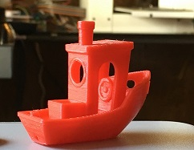

## Marlin 1.1.9
Printrboard and Modern Marlin

### Tested Release For Heated and Non-Heated Bed Models
#### Highlights

* This firmware upgrade increases print quality to a level comparible with Prusa Mk3 or Ultimaker 3 
   all thanks to Linear Advance Version 1.5 which became avalible with marlin 1.1.9
* Babystepping allows live z offset during the start of the print
* 9 Point Auto Bilinear Mesh Bedleving
* Filament Changing routine now accessable from LCD
* Custom scrips from LCD for various tasks such as Home/Bedleveing/Preheat
* 3 Point Leveling seems to work better for smaller beds
* Bilinear Bed Leveling which is usefull for larger unveven beds
* NeoPixel Printer status via EXP2 Header -Printrbot Neopixel is BRG

##### Change Log

v0.3 Software Fan PWM dissabled - caused major decrease in print quality
v0.2 Software FAN PWM enabled to silence squeeky fans

[Marlin 1.1.9 first time bed leveling guide - after flashing](http://marlinfw.org/docs/features/auto_bed_leveling.html#first-time-bed-leveling)

#### Printrbot Play 0.2mm layer height Cura 3.5.1

    
#### This isn't your grandmas 3D printer, please make sure your inductive probe is adjusted properly
* This firmware should be universal for any printrbot, just choose heated bed firmware if you have that option.
* You will need to update the steps/mm for your machine [Avaliable here](https://github.com/Printrbot/Printr-Configs)
* Depending on the model of your printer you will need to adjust the Stepper current

    Steps M92 X80 Y80 Z2020 E94

* Set Stepper Current for your Printer

    M909
    READ: echo:Stepper current values in % (Amps):
    Stepper current values in % (Amps):
    READ: echo: X:60.00 (16581.82) Y:65.00 (36581.82) Z:60.00 (16581.82) E:65.00 (36581.82)
    X:60.00 (16581.82) Y:65.00 (36581.82) Z:60.00 (16581.82) E:65.00 (36581.82)

Example: M907 X60 sets the X-axis motor current to 60% of max possible

    M909 Read Motor current Values
    M907 Set Current Value
    M910 Store Stepper Current Values

	
### Linear Advance is enabled by default
    Retraction distance should be limited to 0.7mm
    Default vaule is K0.08 Be sure to calibrate your extruder before a
    This can be adjusted while printing
    M900 K0.08 ;set k value
    M500 ;save
    Play with MK8 style extruder Use a K0.05
 
   * Calibrate your extruder steps/mm before K-factor
    [Extruder Calibration](http://3daddict.com/3d-printer-extruder-calibration-steps/)
    
   * Please calibrate your K-factor and share results, 
    * Each material and color has it's own properties for best results caibrate for each material you use.
    Add the K value to your start gCode for each material
    [Linear Advance gcode Geneartor](http://marlinfw.org/tools/lin_advance/k-factor.html)

### Babystepping
   * M290 and LCD menu items to move the axes by tiny increments without changing the current position values. 
    This feature is used primarily to adjust the Z axis in the first layer of a print in real-time. Warning: Does not respect endstops!
    * This replaces the need to set the Z offset using M212
    
#### babystepping can be adjusted while printing over usb - no LCD required
Joging the z axis down or up in incriments of 0.1mm while printing adjusts the nozzle offset
This can be done using Cura, Simplify 3D, Pronterface, etc 
Make sure to save the offset by sending the M500 command while printing

Zoffset can also be set using M815 but is not completely nessary
    M815 Z-1.95 ;this is the default value
    Use M500 to save Bed Probing

### LCD semi-tested 
    Custom User Menu Scripts
    Enabled LCD Support for Ultipanel and Ultra_lcd
    SD Card Support on the LCD is dissabled as of right now marlin has exactly engouh memory to fit on the AT90 128

#### PID
READ:  Classic PID 
READ:  Kp: 35.79 Ki: 7.05 Kd: 45.44
READ: PID Autotune finished! Put the last Kp, Ki and Kd constants from below into Configuration.h
READ: #define DEFAULT_Kp 35.79
READ: #define DEFAULT_Ki 7.05
READ: #define DEFAULT_Kd 45.44

### Start gCode

	M82 ;absolute extrusion mode
	G21 ;metric values
	G90 ;absolute positioning
	M82 ;set extruder to absolute mode
	G28 ;move X/Y to min endstops
	G29 ;run auto bed leveling
	G92 E0 ;zero the extruded length
	G1 X0 Y0 Z.2 F7000 ;move to front corner and lower 
	G1 X35 Z.2 E35 F800 ;purge 35mm of filament
	G92 E0 ;zero the extruded length again
	G1 F9000
	;Put printing message on LCD screen
	M117 Printing...

### Usefull gCode
    M420 S1 ;loads previous bed leving matrix
    M900 K0 ;dissables Linear Advance
    M900 K0.5 ;Set linear advance K-value
    M290 Z0.02 ; babystep move up 0.02mm on the Z axis 
    
    M115 Feature support list
    M43 Debug Pins
    
   [Pin Assignments](https://labitat.dk/wiki/Panelolu_and_Printrboard_the_easy_way)

   [Expansion Header pinout diagrams](http://blog.think3dprint3d.com/2012/07/panelolu-with-printrboard.html)
  
  Neopixel Pins

EXP2 Pinout

   Using Printrboard without an LCD - all commands avalible 
   [LCD Menu gcode equivelent](http://marlinfw.org/docs/features/lcd_menu.html)
   
   ## Build Using PlatformIO or Marlin-Config GUI editor
   I find Marlin GUI editor can be very laggy so instead I perfer to access it through Chrome
   
    http://localhost:3000
   
   [Marlin-config GUI](https://github.com/akaJes/marlin-config)
   The printrboard only has 128kb of program memory this build of marlin 1.1.9 as configured currently occupies 99.1%
   
   ## Flash using ATMEL FLIP
   Before Flashing check your eprom and save your steps/mm and machine size 
   After Flashing Make sure to set EPROM to defaults using M502 then M500 to save
   [ATMEL FLIP Download](https://www.microchip.com/developmenttools/ProductDetails/FLIP)
   
   #### Guide
   [Firmware Loading Guide](https://reprap.org/wiki/Printrboard#Loading_Firmware_.28Windows.29)
